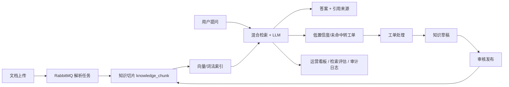

# KnowFlow Backend

KnowFlow 是一个面向企业内部知识服务场景的 Java 后端项目：文档进入知识库后被解析、切片和索引，用户提问时通过 RAG 检索生成答案，低置信度或未命中问题转入工单，工单解决后再沉淀为知识草稿，最终形成“知识接入 -> 智能问答 -> 人工兜底 -> 知识回流 -> 运营观测”的完整闭环。

这个项目定位为 Java 后端求职作品，不是单纯 CRUD 或聊天 demo。它刻意覆盖企业系统常见能力：多租户、RBAC、JWT、异步任务、对象存储、死信治理、审计日志、运维健康、检索评估和 Docker 化部署。

## Highlights

- 完整业务闭环：知识库、文档上传、解析切片、RAG 问答、未命中转工单、知识草稿回流。
- 工程化链路：Spring Boot + MySQL + Redis + RabbitMQ + MinIO + Flyway + Actuator。
- 安全边界：JWT 鉴权、角色权限、多租户隔离、匿名访问和越权访问测试。
- 异步可靠性：解析任务状态机、数据库 CAS、attempt 栅栏、启动恢复、DLQ 和自动重试。
- RAG 可观测：检索来源、query variants、lexical/vector/final score、检索评估管理台。
- 面试友好：内置架构文档、演示脚本、测试策略、部署方案和讲解主线。

## Architecture



## Tech Stack

| Layer | Stack |
|---|---|
| Backend | Java 17, Spring Boot 3.3, Spring MVC |
| Security | Spring Security, JWT, RBAC |
| Persistence | MyBatis-Plus, Flyway, MySQL, H2 |
| Async & Cache | RabbitMQ, Redis |
| Object Storage | MinIO, local storage fallback |
| AI / RAG | OpenAI-compatible chat/embedding API, local fallback, hybrid lexical/vector retrieval |
| Ops | Actuator, health page, task metrics, DLQ governance |
| Frontend | Spring Boot static resources, native HTML/CSS/JavaScript |
| Delivery | Dockerfile, Docker Compose, GitHub Actions |

## Core Modules

- `auth`：登录、JWT、用户、角色、权限菜单、用户中心。
- `tenant`：租户管理和跨租户边界。
- `knowledge`：知识库、文档上传、预览、下载、状态管理。
- `parser`：解析任务、索引任务、RabbitMQ 消费、DLQ、任务治理事件。
- `qa`：问答会话、RAG 检索、来源追踪、反馈、检索评估。
- `ticket`：问答转人工、工单受理、分派、解决、关闭、SLA 展示。
- `backflow`：工单解决后生成知识草稿，审核发布回流知识库。
- `dashboard` / `ops` / `audit`：运营看板、健康监控、AI 用量、审计日志。

## Screens & Entry Points

本地默认端口按运行方式可能是 `8080` 或 `8081`。推荐演示入口：

| Page | URL |
|---|---|
| 运营看板 | `/admin/dashboard` |
| 用户侧智能问答 | `/assistant` |
| 知识库管理 | `/admin/knowledge-bases` |
| 文档管理 | `/admin/documents` |
| 解析任务 | `/admin/parse-tasks` |
| 检索评估 | `/admin/retrieval-evaluations` |
| 问答记录 | `/admin/qa-records` |
| 工单管理 | `/admin/tickets` |
| 知识草稿 | `/admin/knowledge-drafts` |
| 运维健康 | `/admin/ops-health` |
| 死信治理 | `/admin/dead-letters` |
| 审计日志 | `/admin/audit-logs` |
| Swagger | `/swagger-ui.html` |
| Actuator | `/actuator/health` |

演示账号：

```text
tenant.admin / Tenant@123
knowledge.operator / Tenant@123
```

## Quick Start

### Local profile

`local` profile 使用 H2 和本地 fallback，适合快速启动。

```powershell
mvn spring-boot:run "-Dspring-boot.run.profiles=local"
```

或使用 IDEA bundled Maven：

```powershell
& 'C:\Program Files\JetBrains\IntelliJ IDEA 2025.3.3\plugins\maven\lib\maven3\bin\mvn.cmd' spring-boot:run "-Dspring-boot.run.profiles=local"
```

### Dev profile with infrastructure

启动 MySQL、Redis、RabbitMQ、MinIO：

```powershell
$env:KNOWFLOW_MYSQL_HOST_PORT="13306"
$env:KNOWFLOW_REDIS_HOST_PORT="16379"
docker compose -f .\docker-compose.yml up -d
```

启动后端：

```powershell
powershell -NoProfile -ExecutionPolicy Bypass -File .\scripts\start-local-ai.ps1 `
  -ApiKey "<your-api-key>" `
  -Profile dev `
  -DbPort 13306 `
  -RedisPort 16379 `
  -RabbitMqPort 5672
```

更完整的本地启动说明见 [LOCAL_SETUP.md](./LOCAL_SETUP.md)。

## Production-style Deployment

仓库提供一个单机 Docker Compose 线上部署模板：

- [.env.example](./.env.example)：环境变量模板，不包含真实密钥。
- [docker-compose.prod.yml](./docker-compose.prod.yml)：应用 + MySQL + Redis + RabbitMQ + MinIO。
- [docs/DEPLOYMENT.md](./docs/DEPLOYMENT.md)：部署、升级、备份、Nginx 反代和故障排查说明。

部署入口：

```bash
cp .env.example .env
# edit .env and replace every CHANGE_ME value
docker compose -f docker-compose.prod.yml --env-file .env up -d --build
```

健康检查：

```bash
curl http://127.0.0.1:8080/actuator/health
```

## Configuration

关键环境变量：

| Variable | Purpose |
|---|---|
| `KNOWFLOW_JWT_SECRET` | JWT 签名密钥，线上必须替换 |
| `KNOWFLOW_DB_*` | MySQL 连接信息 |
| `KNOWFLOW_REDIS_*` | Redis 连接信息 |
| `KNOWFLOW_RABBITMQ_*` | RabbitMQ 连接和消费配置 |
| `KNOWFLOW_MINIO_*` | MinIO endpoint、bucket、access key |
| `KNOWFLOW_LLM_OPENAI_*` | OpenAI-compatible LLM / embedding 配置 |
| `KNOWFLOW_QA_*` | RAG TopK、召回阈值、词法/向量权重 |

真实 API Key 和 `.env` 不应提交到仓库。

## Testing

运行全部测试：

```powershell
mvn -q test
```

常用专项测试：

```powershell
mvn -q -Dtest=SecurityBoundaryIntegrationTests,ParseTaskAttemptIdempotencyIntegrationTests,SimpleDocumentParsingServiceTests test
```

当前测试覆盖重点：

- 匿名访问、RBAC 越权和跨租户数据隔离。
- 解析任务状态机、CAS 开始执行、attempt 完成栅栏和启动恢复。
- 知识库、文档、解析任务、问答、工单、草稿、看板、审计业务闭环。
- RAG 检索、来源展示、未命中兜底和检索评估。
- Markdown 标题上下文和 FAQ 问答对语义切块。

测试策略见 [docs/testing-strategy.md](./docs/testing-strategy.md)。

## Interview Storyline

面试讲项目时可以按这条主线展开：

1. 企业内部知识散落，客服和员工重复提问，人工压力大。
2. 构建知识服务和工单协同平台，让可回答问题自动回答，不能回答的问题进入人工闭环。
3. 文档上传后异步解析切片，问答时做混合检索并展示引用来源。
4. 低置信度或未命中问题转工单，工单解决后生成知识草稿，审核后回流知识库。
5. 用运营看板、检索评估、DLQ、Actuator 和审计日志证明系统可观测、可治理。

详细版本见 [docs/interview-storyline.md](./docs/interview-storyline.md)。

## Documentation Map

| Document | Purpose |
|---|---|
| [docs/PROJECT_HANDOFF.md](./docs/PROJECT_HANDOFF.md) | 项目交接、当前进度、下一步计划 |
| [docs/PROJECT_ARCHITECTURE.md](./docs/PROJECT_ARCHITECTURE.md) | 系统架构和模块设计 |
| [docs/DEPLOYMENT.md](./docs/DEPLOYMENT.md) | 线上部署方案 |
| [docs/testing-strategy.md](./docs/testing-strategy.md) | 测试策略与验证矩阵 |
| [docs/async-task-governance.md](./docs/async-task-governance.md) | 异步任务幂等、状态机和恢复 |
| [docs/retrieval-evaluation.md](./docs/retrieval-evaluation.md) | RAG 检索评估方法 |
| [docs/ops-observability.md](./docs/ops-observability.md) | 运维健康、AI 用量、DLQ 指标 |
| [docs/FINAL_DEMO_SCRIPT.md](./docs/FINAL_DEMO_SCRIPT.md) | 最终演示脚本 |
| [docs/SMOKE_TEST.md](./docs/SMOKE_TEST.md) | dev 容器环境 smoke test |

## Roadmap

- AI 成本和 Token 统计进一步细化到用户、模型、知识库维度。
- 文档解析继续扩展 Word、扫描版 PDF OCR 和受控网页内容接入。
- 多租户权限增加部门、数据范围等更细粒度模型。
- 前端迁移到 Vue/React，形成前后端分离版本。
- 部署形态继续补充 HTTPS、日志采集、备份恢复和灰度发布。
