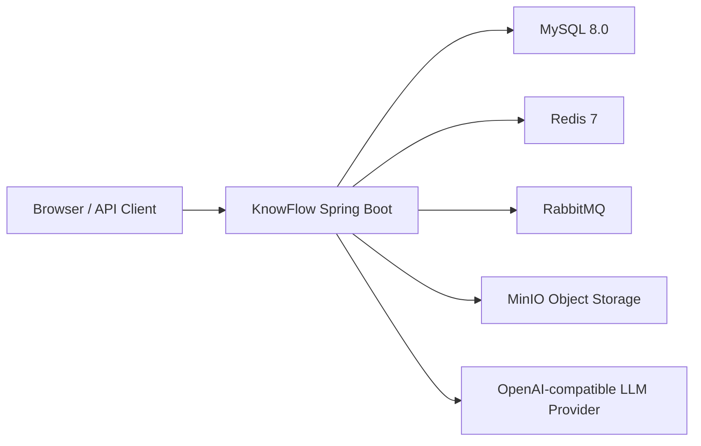

# KnowFlow 线上部署方案

本文档给出一个可落地的单机 Docker Compose 部署方案，适合云服务器、内网演示机或面试作品展示环境。它不是高可用架构，但覆盖了应用、MySQL、Redis、RabbitMQ、MinIO、环境变量和健康检查的完整闭环。

## 1. 部署形态



服务职责：

- `knowflow-backend`：Spring Boot 后端和静态管理台页面。
- `mysql`：业务数据、租户、权限、知识库、问答、工单、审计日志。
- `redis`：解析任务运行态、worker 锁、检索缓存等。
- `rabbitmq`：文档解析和索引任务消息流。
- `minio`：上传文档对象存储。
- OpenAI-compatible LLM：可选；未配置时系统会回退到本地模板回答和本地 hash embedding。

## 2. 准备服务器

最低建议：

- 2 核 CPU
- 4 GB 内存
- 30 GB 磁盘
- Docker Engine / Docker Desktop
- Docker Compose v2

开放端口按实际需要选择：

| 端口 | 服务 | 建议 |
|---|---|---|
| `8080` | KnowFlow Web/API | 对外开放或交给 Nginx 反代 |
| `3306` | MySQL | 不建议公网开放 |
| `6379` | Redis | 不建议公网开放 |
| `5672` | RabbitMQ AMQP | 不建议公网开放 |
| `15672` | RabbitMQ 管理台 | 仅内网或 VPN |
| `9000` | MinIO API | 仅内网或反代 |
| `9001` | MinIO Console | 仅内网或 VPN |

## 3. 配置环境变量

复制模板：

```bash
cp .env.example .env
```

必须替换：

- `KNOWFLOW_JWT_SECRET`
- `KNOWFLOW_DB_PASSWORD`
- `KNOWFLOW_MYSQL_ROOT_PASSWORD`
- `KNOWFLOW_RABBITMQ_PASSWORD`
- `KNOWFLOW_MINIO_SECRET_KEY`

如果要接真实大模型，还需要设置：

- `KNOWFLOW_LLM_OPENAI_ENABLED=true`
- `KNOWFLOW_LLM_OPENAI_BASE_URL`
- `KNOWFLOW_LLM_OPENAI_API_KEY`
- `KNOWFLOW_LLM_OPENAI_CHAT_MODEL`
- `KNOWFLOW_LLM_OPENAI_EMBEDDING_MODEL`

安全提醒：

- 不要提交 `.env`。
- 不要使用 `.env.example` 里的 `CHANGE_ME` 值上线。
- `application.yml` 中的默认 JWT secret 只适合本地开发，线上必须使用环境变量覆盖。
- 如果同一台机器已经有一套 KnowFlow dev 容器，建议修改 `KNOWFLOW_*_CONTAINER_NAME` 和宿主机端口，避免容器名或端口冲突。

## 4. 启动

构建并启动全量服务：

```bash
docker compose -f docker-compose.prod.yml --env-file .env up -d --build
```

查看状态：

```bash
docker compose -f docker-compose.prod.yml --env-file .env ps
```

查看应用日志：

```bash
docker logs -f knowflow-backend
```

健康检查：

```bash
curl http://127.0.0.1:8080/actuator/health
```

管理台入口：

```text
http://127.0.0.1:8080/admin/dashboard
```

用户侧问答入口：

```text
http://127.0.0.1:8080/assistant
```

## 5. 部署验收

启动后建议先执行生产 smoke test，覆盖健康接口、核心页面、登录态、菜单、运营看板和知识库列表接口：

```powershell
powershell -NoProfile -ExecutionPolicy Bypass -File .\scripts\prod-smoke-test.ps1 `
  -BaseUrl http://127.0.0.1:8080
```

如果部署机没有 PowerShell，也可以用下面的最小验收命令：

```bash
curl -f http://127.0.0.1:8080/actuator/health
curl -I http://127.0.0.1:8080/admin/dashboard
curl -I http://127.0.0.1:8080/assistant
```

smoke test 默认把报告写到 `target/prod-smoke-test-report.json`，该目录不会提交到 Git。验收通过时应至少看到：

- `/actuator/health` 返回 HTTP 200。
- `/admin/dashboard`、`/assistant`、`/swagger-ui.html` 返回 HTTP 200。
- `tenant.admin / Tenant@123` 能登录并读取当前用户、菜单、看板概览和知识库列表。

本轮本地生产 Compose 验收记录：

- 镜像构建：`docker compose -f docker-compose.prod.yml --env-file target/prod-smoke.env -p knowflow-prod-smoke up -d --build` 通过。
- 服务状态：app、MySQL、Redis、RabbitMQ、MinIO 均成功启动，MySQL/Redis/RabbitMQ healthcheck 为 healthy。
- smoke test：`scripts/prod-smoke-test.ps1 -BaseUrl http://127.0.0.1:18080` 通过。

## 6. 升级发布

拉取最新代码后重新构建应用镜像：

```bash
git pull
docker compose -f docker-compose.prod.yml --env-file .env up -d --build app
```

如果数据库迁移脚本有新增版本，应用启动时 Flyway 会自动执行迁移。上线前建议先在测试环境验证 `mvn test` 和 smoke test。

## 7. 停止与备份

停止服务但保留数据卷：

```bash
docker compose -f docker-compose.prod.yml --env-file .env stop
```

不要随意执行：

```bash
docker compose -f docker-compose.prod.yml down -v
```

`-v` 会删除 MySQL、Redis、RabbitMQ、MinIO 数据卷。

建议定期备份：

- MySQL：`mysqldump`
- MinIO：对象桶数据或 volume 快照
- `.env`：加密保存，不放入代码仓库

## 8. Nginx 反向代理示例

示例配置：

```nginx
server {
    listen 80;
    server_name knowflow.example.com;

    location / {
        proxy_pass http://127.0.0.1:8080;
        proxy_set_header Host $host;
        proxy_set_header X-Real-IP $remote_addr;
        proxy_set_header X-Forwarded-For $proxy_add_x_forwarded_for;
        proxy_set_header X-Forwarded-Proto $scheme;
    }
}
```

生产环境建议启用 HTTPS，并将 MySQL、Redis、RabbitMQ、MinIO 管理端口限制在内网。

## 9. 故障排查

常见问题：

- Docker 启动时报 `container name is already in use`：说明同机已有同名容器。修改 `.env` 中的 `KNOWFLOW_APP_CONTAINER_NAME`、`KNOWFLOW_MYSQL_CONTAINER_NAME`、`KNOWFLOW_REDIS_CONTAINER_NAME`、`KNOWFLOW_RABBITMQ_CONTAINER_NAME`、`KNOWFLOW_MINIO_CONTAINER_NAME` 后重试。
- 应用无法连接 MySQL：检查 `.env` 中 `KNOWFLOW_DB_HOST=mysql`、密码和容器健康状态。
- Redis health down：检查 `KNOWFLOW_REDIS_HOST=redis`，不要使用宿主机 `127.0.0.1`。
- RabbitMQ 消息不消费：检查 `KNOWFLOW_PARSE_MESSAGING_MODE=rabbit` 和 RabbitMQ 账号密码。
- MinIO 上传失败：检查 `KNOWFLOW_MINIO_ENDPOINT=http://minio:9000`、access key、secret key 和 bucket 自动创建配置。
- LLM 没有真实回答：检查 `KNOWFLOW_LLM_OPENAI_ENABLED=true`、base URL、API Key 和模型名。

验证命令：

```bash
docker logs --tail 200 knowflow-backend
docker logs --tail 100 knowflow-mysql
docker logs --tail 100 knowflow-rabbitmq
docker logs --tail 100 knowflow-minio
```
